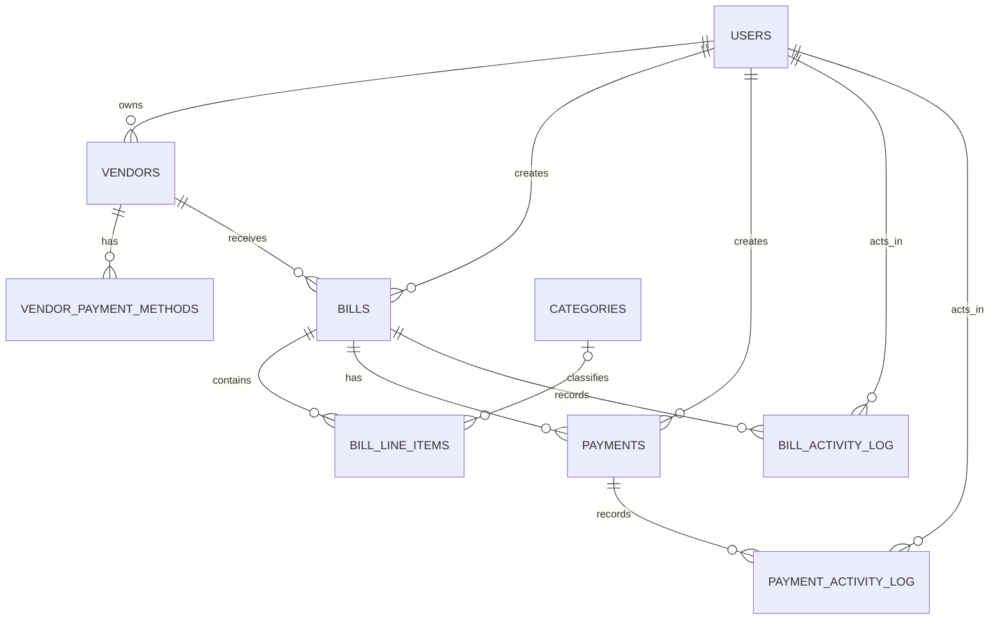

# Bill Pay MVP

Accounts payable management with role-based access, bill and payment lifecycles, bulk operations, configurable table views, and filtered CSV exports.

See [REQUIREMENTS.md](./docs/REQUIREMENTS.md) for the full spec and [PR-PLAN.md](./docs/PR-PLAN.md) for the delivery plan.

## Stack

Next.js 16 (App Router, Turbopack) · React 19 · TypeScript strict · Clerk · Drizzle ORM · NeonDB · Zod · TanStack Table · React Hook Form · nuqs · Tailwind CSS · Vitest · ESLint (Airbnb)

## Setup

```bash
# 1. Install dependencies
corepack enable
yarn install

# 2. Configure environment
cp .env.example .env.local
# Fill in DATABASE_URL + Clerk env vars.

# 3. Apply the schema to your Neon database (once DATABASE_URL is set)
yarn db:push
```

## Deploy to Vercel (Neon + Clerk)

1. Create a Neon Postgres project and copy the pooled connection string into `DATABASE_URL`.
   Example format: `postgresql://neondb_owner:<password>@ep-example-123456-pooler.us-east-2.aws.neon.tech/neondb?sslmode=require`
2. In Clerk, create a Next.js application and copy:
   - `CLERK_SECRET_KEY`
   - `NEXT_PUBLIC_CLERK_PUBLISHABLE_KEY`
   - `CLERK_WEBHOOK_SECRET`
3. In Vercel project settings, add all env vars from `.env.example` to:
   - `Production`
   - `Preview`
   - `Development` (optional if you use local env only)
4. In Clerk webhooks, add endpoint:
   - `https://<your-vercel-domain>/api/webhooks/clerk`
   - subscribe to `user.created` and `user.updated`
   - use the matching `CLERK_WEBHOOK_SECRET`
5. Keep Clerk sign-in/sign-up redirects pointed at `/`.
   The root route forwards authenticated users to `/bills?tab=drafts`.
6. Run schema migration against Neon before first production usage:
   - locally: `yarn db:push`
   - or CI/release job: `yarn db:migrate`
7. Deploy to Vercel and verify:
   - `/sign-in` renders Clerk sign-in
   - `/api/health/db` returns `{ "ok": true }`
   - signing in creates or updates a row in Neon `users`
   - protected routes redirect unauthenticated users
   - webhook delivery succeeds in Clerk dashboard logs

## Scripts

| Command | Purpose |
|---|---|
| `yarn dev` | Run the dev server on `localhost:3000`. |
| `yarn build` | Production build. |
| `yarn typecheck` | Type-check without emitting. |
| `yarn lint` | ESLint (Airbnb ruleset). |
| `yarn test` | Run all Vitest projects. |
| `yarn test:unit` | Pure unit tests (state machine, validators). |
| `yarn test:components` | Component tests. |
| `yarn db:generate` | Generate a Drizzle migration from the schema. |
| `yarn db:migrate` | Apply pending migrations (includes demo seed data). |
| `yarn db:push` | Push the schema directly (dev convenience — does not run seed migrations). |

## Architecture

The application keeps framework-facing code thin and moves domain work through explicit layers:

```
App Router pages and components
        |
Server actions and route handlers
        |
Zod validation + Clerk-backed auth and role guards
        |
Use cases
        |
Pure lifecycle state machines + repositories
        |
Drizzle ORM over Neon HTTP
```

### Layer responsibilities

| Layer | Responsibility |
|---|---|
| `src/app/` | Next.js pages, route handlers, and reusable UI. Bills and payments keep workspace-specific controllers while sharing table, filter, selection, saved-view, and export primitives. |
| `src/lib/actions/` | Mutation boundaries. Server actions validate input, resolve the current local user, enforce roles, invoke one use case, and return an `ActionResult`. |
| `src/lib/use-cases/` | Domain orchestration. Use cases select valid operations and keep UI/framework details out of repositories. |
| `src/lib/services/` | Pure lifecycle rules. Bill and payment transition maps are testable without database access. |
| `src/lib/repositories/` | Drizzle reads and writes. Repositories own filtering, sorting, pagination, optimistic concurrency checks, and activity-log persistence. |
| `src/db/schema/` | PostgreSQL contracts, split one table or enum group per file. |

### Key architecture decisions

- **Clerk is the identity provider; Neon is the application authorization source.** Clerk users are synced into `users`, and role checks use the local `users.role` value.
- **Lifecycle transitions are explicit state machines.** Bills and payments each have a pure transition map. User-driven actions must pass through the map before a repository write.
- **Concurrent lifecycle writes fail instead of silently overwriting newer state.** Transition updates include the expected current status in their `WHERE` clause. Draft edits can also include an expected `updated_at` value.
- **Domain history is append-only.** Bill and payment status changes write activity records with an actor, action, timestamp, and optional metadata. Repository methods pair lifecycle writes with their audit append through `db.batch()`.
- **List endpoints are server-driven.** Filters, sort order, tab scope, and pagination are translated into SQL. Bills are paginated in two phases: select ordered bill IDs first, then hydrate line items, avoiding duplicate parent rows from one-to-many joins.
- **Workspace state has two representations.** URL parameters remain the shareable source for the active table state. A versioned JSONB document on `users` optionally persists each user's saved filters, sort, page size, and hidden columns per workspace tab.
- **CSV exports reuse list semantics.** Export route handlers parse the same tab, filter, sort, and visible-column inputs as their workspace tables, then return dynamically generated downloads.

## Data Model



| Table | Purpose | Important relationships and behavior |
|---|---|---|
| `users` | Local application user synced from Clerk. Stores the authorization role and saved workspace preferences. | `clerk_id` is unique. |
| `vendors` | Supplier master record. | Optional owner points to `users`; deleting an owner leaves the vendor intact. |
| `vendor_payment_methods` | Reusable vendor payment instructions. | Belongs to a vendor. A partial unique index allows at most one default method per vendor. |
| `categories` | Accounting category lookup. | Category names are unique. |
| `bills` | Payable invoice and its approval/payment-facing state. | Belongs to a vendor and creator. Money uses `numeric(12, 2)` plus a currency code. Invoice files are stored as URLs, not blobs. |
| `bill_line_items` | Ordered bill breakdown. | Belongs to a bill; optional category classification is cleared if a category is deleted. |
| `payments` | Payment execution record attached to a bill. | Belongs to a bill and creator. Tracks method type, status, schedule/initiation/arrival dates, cancellation time, and failure reason. |
| `bill_activity_log` | Append-only bill audit history. | Cascades with its bill; actor deletion is restricted. |
| `payment_activity_log` | Append-only payment audit history. | Cascades with its payment; actor deletion is restricted. |

### Lifecycle enums

- Bills: `draft`, `awaiting_approval`, `approved`, `scheduled`, `initiated`, `paid`, `archived`, `rejected`, `payment_failed`.
- Payments: `pending`, `scheduled`, `initiated`, `in_transit`, `paid`, `failed`, `cancelled`.
- Payment methods: `ach`, `wire`, `check`, `card`.
- User roles: `admin`, `owner`, `ap_clerk`, `approver`, `employee`.

### Current modeling boundaries

- The schema does not currently contain an organization or tenant table. All data is application-wide.
- Vendor payment instructions are normalized in `vendor_payment_methods`, but `payments` currently stores a payment-method enum rather than a foreign key to a specific vendor payment method.
- A bill can have multiple payment rows at the database level. There is not yet a database constraint limiting active payments per bill.
- Retrying a failed payment currently transitions the same payment row back to `scheduled`; it does not create a linked payment attempt.
- Saved workspace preferences intentionally live in a versioned JSONB document on `users`. They are user-interface state, not financial domain records.

## Skipped Features

- **Custom saved views were not added.** Users can save one set of filters, sort order, page size, and hidden columns for each built-in Bills or Payments tab. They cannot create, name, or switch between additional custom views.

## Status

The repository currently includes the protected Bills and Payments workspaces, lifecycle actions, filters, sorting, pagination, bulk actions, saved per-user tab preferences, activity logs, and filtered CSV exports. See [PR-PLAN.md](./docs/PR-PLAN.md) for the delivery plan.
