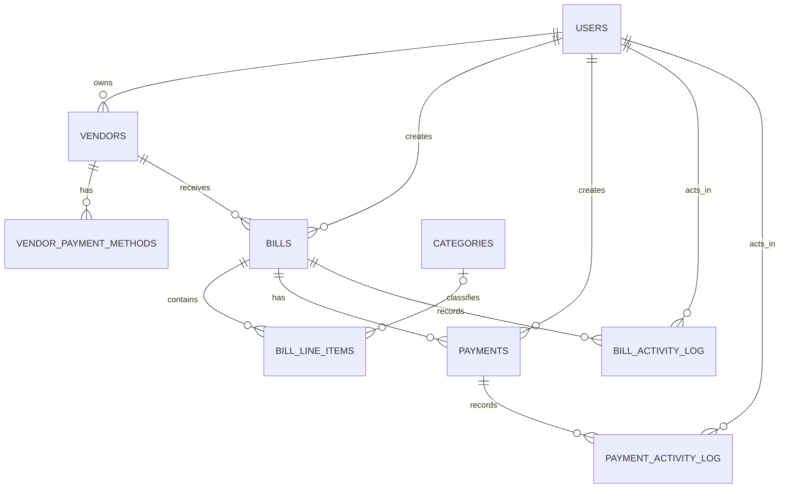

# Data Model

| Table | Purpose | Important relationships and behavior |
|---|---|---|
| `users` | Local application user synced from Clerk. Stores the authorization role and saved workspace preferences. | `clerk_id` is unique. |
| `vendors` | Supplier master record. | Optional owner points to `users`; deleting an owner leaves the vendor intact. |
| `vendor_payment_methods` | Reusable vendor payment instructions. | Belongs to a vendor. A partial unique index allows at most one default method per vendor. |
| `categories` | Accounting category lookup. | Category names are unique. |
| `bills` | Payable invoice and its approval/payment-facing state. | Belongs to a vendor and creator. Money uses `numeric(12, 2)` plus a currency code. Invoice files are stored as URLs, not blobs. |
| `bill_line_items` | Ordered bill breakdown. | Belongs to a bill; optional category classification is cleared if a category is deleted. |
| `payments` | Payment execution record attached to a bill. | Belongs to a bill and creator. Tracks method type, status, schedule/initiation/arrival dates, cancellation time, and failure reason. |
| `bill_activity_log` | Append-only bill audit history. | Cascades with its bill; actor deletion is restricted. |
| `payment_activity_log` | Append-only payment audit history. | Cascades with its payment; actor deletion is restricted. |

## Lifecycle enums

- Bills: `draft`, `awaiting_approval`, `approved`, `scheduled`, `initiated`, `paid`, `archived`, `rejected`, `payment_failed`.
- Payments: `pending`, `scheduled`, `initiated`, `in_transit`, `paid`, `failed`, `cancelled`.
- Payment methods: `ach`, `wire`, `check`, `card`.
- User roles: `admin`, `owner`, `ap_clerk`, `approver`, `employee`.

## Current modeling boundaries

- The schema does not currently contain an organization or tenant table. All data is application-wide.
- Vendor payment instructions are normalized in `vendor_payment_methods`, but `payments` currently stores a payment-method enum rather than a foreign key to a specific vendor payment method.
- A bill can have multiple payment rows at the database level. There is not yet a database constraint limiting active payments per bill.
- Retrying a failed payment currently transitions the same payment row back to `scheduled`; it does not create a linked payment attempt.
- Saved workspace preferences intentionally live in a versioned JSONB document on `users`. They are user-interface state, not financial domain records.
